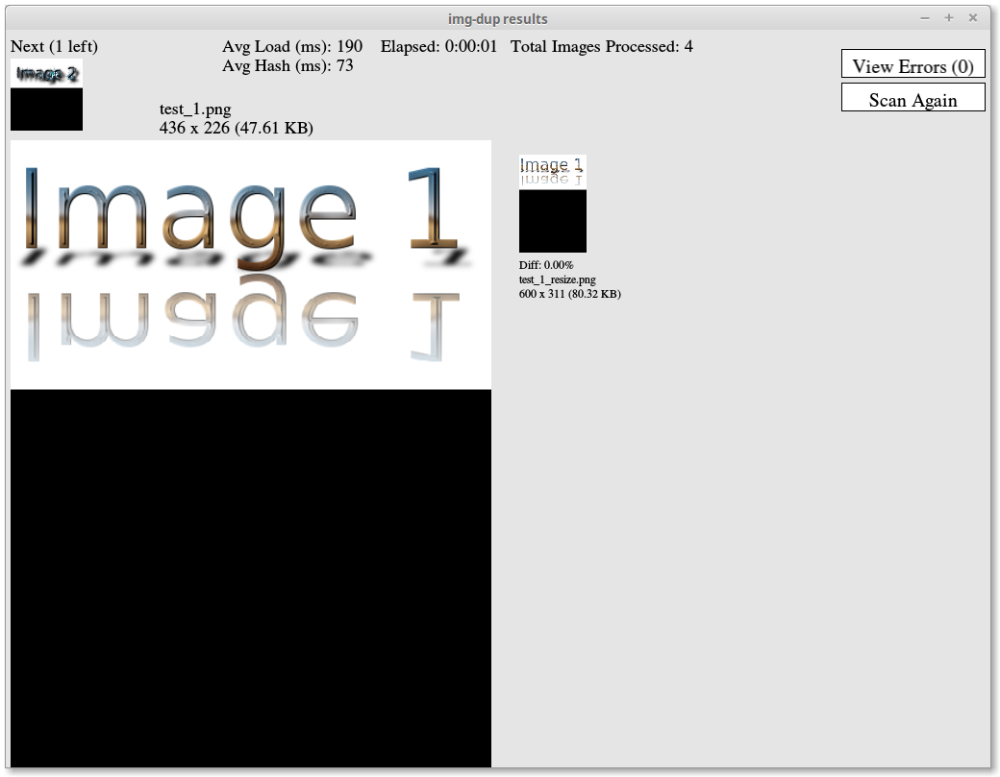

`img_dup` GUI Guide
=================

To start `img_dup` in GUI mode, pass the `-g` flag. Any other config flags will set the starting values in the setup window.

#####Note
`img_dup` must be compiled will GUI support or else it will simply print a warning and exit. See `README.md` in this repository for more information.

####Running `img_dup`
Cargo:
```shell
cargo run --features="gui" -- -g
```

Standalone binary:
```shell
./img_dup -g
```

Setup Window
------------


This window is where you set the search configuration. Set the options and click "Go!" to begin the search. The options are as follows:

#####Search Directory
The directory to search for images. Click "Browse" to browse for a folder, or enter a path into the text field. 

Also set by the `--dir` command-line flag.

#####Threads
The number of threads to run image loading and hashing in parallel. By default, this is set to the number of CPUs as reported by your operating system. Hyperthreaded Intel CPUs will report double the number of physical cores.

It is recommended to leave this at default for best performance. More threads will usually only introduce additional overhead, while fewer threads will throttle the loading and hashing. 

Reduce the number of threads if the default makes your computer slow or unstable in the next step.

Also set by the `--threads` command-line flag.

#####Hash Size
The square of this number is the number of bits to use in the image hash. Generally, a higher number will create a more detailed hash at the cost of memory usage and performance. Reduce this to reduce memory usage and possibly improve performance at the cost of accuracy. The default should be accurate enough for most uses.

Also set by the `--hash-size` command-line flag.

#####Recurse
If enabled (black square instead of white), search subdirectories as well. Will compare images across directories.

#####Use DCT
Use the more accurate but slower Discrete Cosine Transform hash. It is recommended to leave this enabled.

The faster hash will not catch major edits or color changes, and should only be used with a threshold below 1% to find near or complete duplicates.

Disabled by the `--fast` command-line flag.

#####Threshold
The percentage (%) that an image must **differ** from another to count as unique. Raise this to widen the matching criteria, or lower it to increase specificity. Use a threshold below 1% to match only on near or complete duplicates or resizes. A threshold above 3% will match a lot of false-positives, as an image that counts as similar to the matching algorithm may appear entirely different to the eye.

Set by the `--threshold` command-line flag.

Running Window
--------------


The white-and-black bar is the progress bar for the processing. The % on the side is the percent-done status.

This window will close automatically when the processing is done (or cancelled), and the results window will open.

#####Current (Errors) / Total
The number of images done so far out of the total images found, along with the number of images that could not be opened (either they were the wrong format or there was an error reading them).

#####Elapsed
The time elapsed so far, in the `hours:minutes:seconds` format.

#####Avg Load (ms)
The time it takes to load an image, on average, in milliseconds. 1 second = 1000 milliseconds.

#####Avg Hash (ms)
The time it takes to hash an image, on average, in milliseconds. The sum of this and **Avg Load (ms)** should be about the average time to process a single image, not including time spent in the matching algorithm.

#####ETA
The estimated time left based on the current elapsed time and the average image processing time, in the `hours:minutes:seconds` format.

#####Stop
Stop processing, and only compare the images already done. A dialog will appear to confirm this action.

Results Window
--------------
(Black areas in image areas are to be expected. Transparent areas in images with an alpha channel will have a black background.)

###Overview Mode


If there are no images left in the queue after the last one has had all actions taken, or no matches were found, a dialog will appear asking if you want to scan again. Click "Yes" to be taken back to the setup window, or "No" to exit.

The thumbnail in the top-left corner is the next image to inspect, or none if there are no images left. Click it to skip to the next image. A dialog will appear to confirm this action, as you cannot go back. 

The main features of this window are the large preview of the "master" image on the left (with its file information printed above), and a list of thumbnails on the right (with their file information printed below each one, as well as % difference).

Click a thumbnail on the right to switch to **Compare Mode**, which enlarges the matched image and its information, and adds several action buttons above it.

#####View Errors(#)
Open the **Errors Window** to view the error messages for the images that could not be loaded.

#####Scan Again
Trigger the "Scan Again?" dialog.

###Compare Mode


Click the image on the right to return to **Overview Mode**.

When all matches have been removed for a "master" image, the results window will automatically advance to the next image, or ask you to scan again if there is no next image. Click "Yes" to be taken back to the setup window, or "No" to exit.

#####Promote
Promote the image on the right to "master", switching the left and right and recalculating the differences between the new "master" and the rest of the images.

#####Ignore
Do nothing with this image except remove it from the list of matches. Use this to skip false-positives.

#####Delete
Delete this image from the disk and remove it from the list of matches. A dialog will appear to confirm this action, as it **cannot be undone** (permanent deletion).

#####Symlink
Replace this image on-disk with a symbolic link to the "master" image under the same name, and remove it from the list of matches. 

Safer than deletion, but still **cannot be undone** (the original image will still be deleted from disk). A dialog will appear to confirm.

Errors Window
------------


View error messages for individual images. **Image** and **Message** will display `N/A` if there were no errors.

#####Prev
Go to the previous error, if any.

#####Next
Go to the next error, if any.

#####Done
Close this dialog and resume comparing results.

#####Image
The path of the image that could not be loaded or hashed.

#####Message
The error message resulting from attempting to load or hash the image.

